Microsoft Cloud App Security (MCAS) is Microsoft's CASB product. We can integrate this with Zscaler Internet Access (ZIA) - and vice-versa.

ZIA will be able to pull data from MCAS under the Cloud Applications dashboard, and MCAS will be able to push custom URL categories to your ZIA tenant for your specified sanctioned/unsanctioned applications - which you can then configure allow/coach/block rules for Zscaler to enforce as required.

You must have a subscription for both MCAS and Zscaler's Nanolog Streaming Service (NSS) to be able to integrate the two products.

# Requirements
## 1. Zscaler NSS
To stream Zscaler logs to MCAS, you will need to have deployed and configured Zscaler's Nanolog Streaming Service (NSS) in the ZIA admin portal - this allows you to stream logs from their logging clusters (called Nanolog) towards a SIEM or product of your choice (in this case, MCAS).

You can deploy the VM for NSS on-prem (available as an OVA image) or in AWS or Azure.
For deployment in Azure, you can review my guide here. Zscaler documentation is available for [VMware](https://help.zscaler.com/zia/nss-deployment-guide-vmware-vsphere) and [AWS](https://help.zscaler.com/zia/nss-deployment-guide-amazon-web-services).

Your NSS VM must have a state of **Healthy** to be able to integrate with MCAS.


NB: Your NSS VM must have at least 8GB of memory for MCAS integration. If you're running a 4GB instance as a demo/lab NSS VM, this will not work and you'll need to deploy another instance with at 8GB assigned.


## 2. Zscaler MCAS NSS Feed
Once you have deployed Zscaler NSS above, you'll also need to have an MCAS Feed configured before you can properly integrate with MCAS.

An NSS feed specifies the data you wish to stream from Nanolog: You can stream everything, or filter the data to only receive what you care about (security events, information relating to a specific user, etc).

An MCAS NSS Feed, is an NSS Feed specifically pre-formatted for ingestion into MCAS.

### Add a New MCAS NSS Feed
In your ZIA portal, navigate to **Administration > Nanolog Streaming Service**.

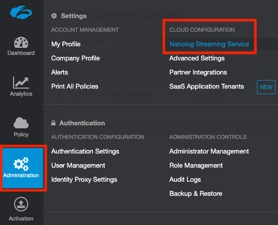

Select the **NSS Feeds** tab, then select **Add MCAS NSS Feed**.


Give the feed a name, select the NSS Server / VM instance that is associated with streaming this feed, and make sure you set the feed to **Enabled**. You can optionally define filters for the feed at the bottom of the panel. By default, EVERYTHING will be streamed to MCAS.

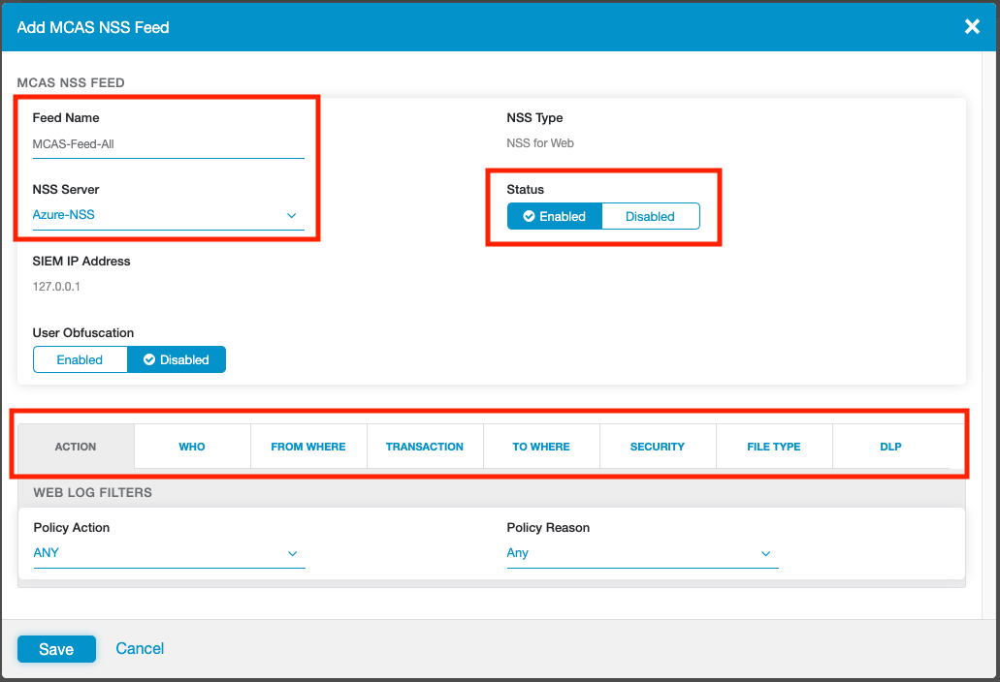

When you are done, click **Save**, then **Activate** your changes. This will apply the feed to the NSS VM you selected.


# Configure MCAS
In this section, we'll focus on the MCAS specific config, including:
* Generating an API token
* Setting at least 1 app as unsanctioned
* Adding NSS as a data source


## Access the MCAS Portal
You can access your MCAS Dashboard at the following link:
[https://portal.cloudappsecurity.com/](https://portal.cloudappsecurity.com/)

Alternatively, you access MCAS via the [Microsoft 365 Admin Center](https://security.microsoft.com/), under Security > More Resources > Cloud App Security.


## Generate an MCAS API Token
From the MCAS dashboard, click the **Settings** icon at the top right, and select **Security extensions**.


On the **API tokens** tab, click the + icon to create a new token.


Give the token a name (eg: `Zscaler Integration`) and click **Generate**.

**Note down both the API token and URL** on screen as you will need these later! After you close this window, the token will NOT be shown again.


## Configure an Unsanctioned App
To verify that the integration is working correctly, you must [configure at least one unsanctioned application](https://docs.microsoft.com/en-us/cloud-app-security/governance-discovery).

In the MCAS portal, navigate to **Discover > Cloud app catalog**. Search for an application, then under **Actions**, click the three dots and select **Unsanctioned**.

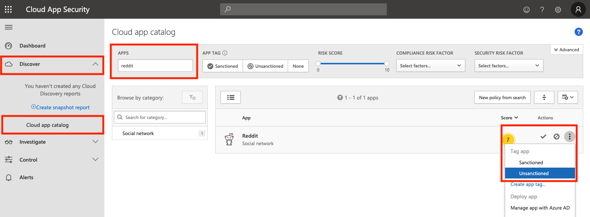

Apps that you set as unsanctioned will be pushed to Zscaler every 2 hours.


## Add Zscaler NSS as a Data Source
You must [explicitly configure MCAS](https://docs.microsoft.com/en-us/cloud-app-security/zscaler-integration) to accept logs from NSS by adding NSS as a Data Source within the MCAS portal.

From the MCAS dashboard, click the **Settings** icon at the top right, and select **Log collectors**.


Make sure **Automatic log upload** is selected in the sidebar and that you are on the **Data sources** tab.

Click **Add data source...**

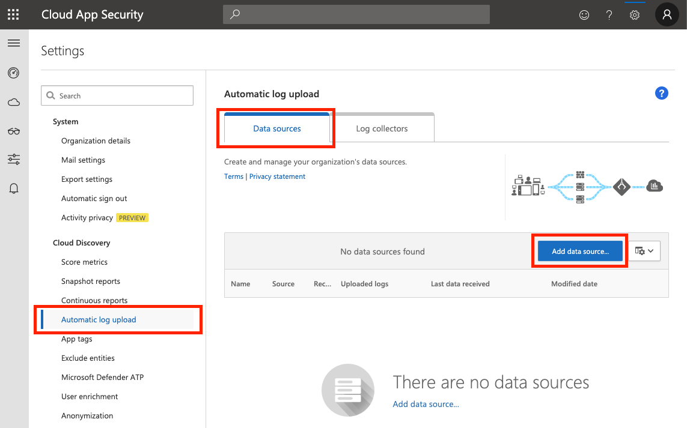

Enter the following information:
* Name = **NSS**
* Source = **Zscaler - QRadar LEEF**
* Receiver type = **Syslog - UDP**

Note: These three fields must be EXACTLY as the above - including the name. **If the data source name is anything other than **`NSS`**, MCAS will not receive the log data from NSS.**

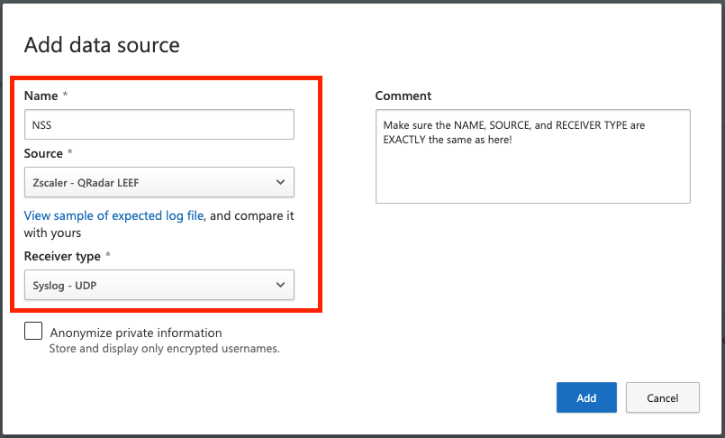

Optionally set a comment, and click **Add**.


# Configure Zscaler (ZIA)
In this section, we'll configure MCAS integration on the Zscaler side by adding the MCAS API token to the ZIA admin portal, and (optionally) configure a URL filtering policy to block the MCAS unsanctioned apps.

## Provide the MCAS API Token

Navigate to **Administration > Partner Integrations**.


Under the **Microsoft Cloud App Security** tab, **paste in your MCAS API Token** in the area provided and click **Test**.

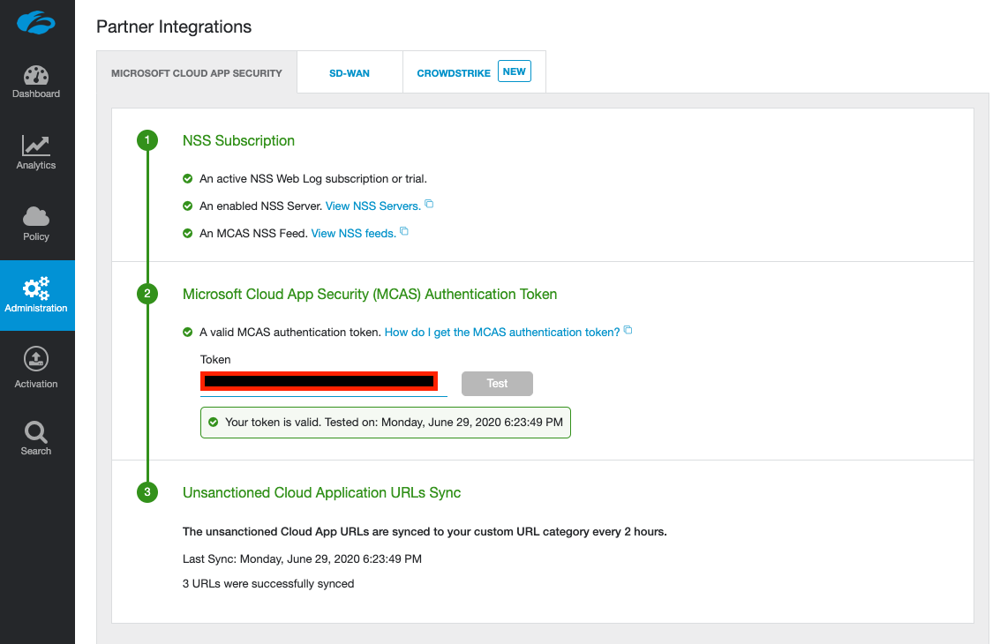

This will validate your token, and if correct, will begin synchronization with MCAS.

If you receive an error, make sure you've configured at least one application as unsanctioned (as per the above).


## (Optional) Block (or Caution) Access to unsanctioned apps

Unsanctioned apps synchronized from MCAS are put into a custom URL category called **MCAS Unsanctioned Apps**. Block or caution on access to these by creating a URL Filtering Policy.

Navigate to **Policy > URL & Cloud App Control**.

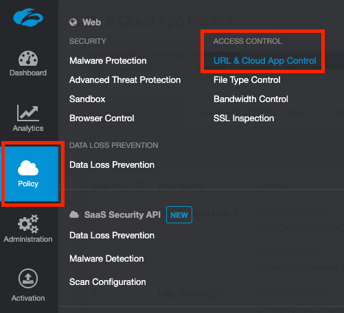

Click **Add URL Filtering Policy** and under the **URL Categories** dropdown, search for and select **MCAS Unsanctioned Apps**.

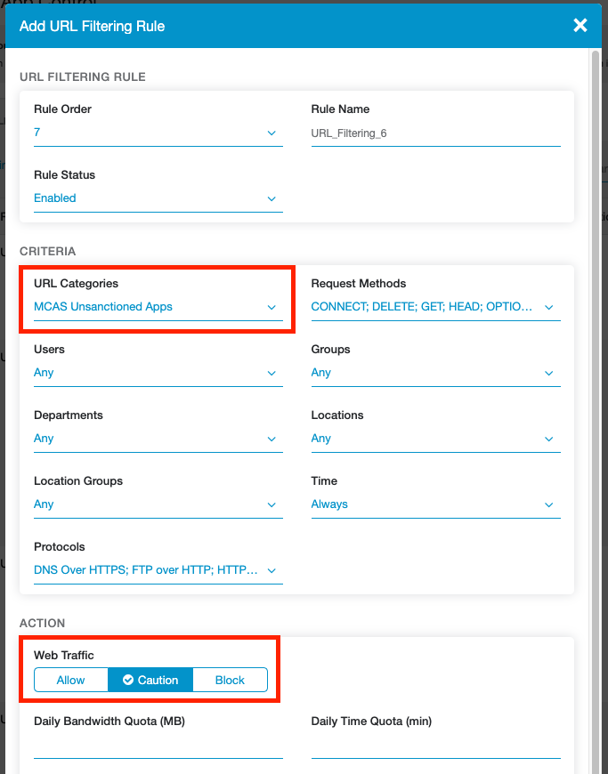

Target this policy to specific users/groups/departments/locations as needed, and select an appropriate action (Allow, Caution, or Block). Click **Save** when finished and activate your changes.

Wait a moment, then attempt to visit one of the apps you marked in MCAS as unsanctioned.

In this example, Reddit was marked as unsanctioned and configured with a Caution action in the URL Filtering Policy. Attempting to access Reddit as a user going through ZIA now results in the following:


If you have issues with your block not applying, check you have SSL Inspection configured that and you aren't accidentally bypassing/exempting the site. A site is being SSL inspected if you can see the Zscaler Root CA and Intermediate Root CA present when examining the SSL certificate of the site.

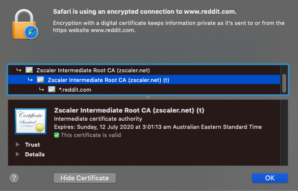


# Configure the Zscaler NSS Server VM
The last bit of config we need to do is to explicitly configure the NSS VM for MCAS by providing it with the MCAS API token. This will allow the NSS VM to make a connection to your MCAS tenant and forward logs.

## Add your MCAS API Token and Domain to NSS


Log into your NSS VM. In my case, I'll SSH to it:

```
ssh zsroot@<ip-of-nss-vm>

Last login: Mon Jun 29 11:21:27 2020 from 10.0.88.4
ZscalerOS 10-R (SMKERNEL) #124: Fri Nov  2 17:44:46 PDT 2018
[zsroot@NSS ~]$ 
```

Run the `configure-mcas` command, and paste in your MCAS API token and MCAS domain when prompted:
```
[zsroot@NSS ~]$ sudo nss configure-mcas

token (Authentication token for uploading to MCAS) []:
domain (MCAS domain like mycompany.portal.cloudappsecurity.com) []:
```

**DO NOT** enter the full MCAS URL - enter the domain part only. For example, if your URL is `https://company.us3.portal.cloudappsecurity.com/`, drop the `https://` and trailing `/` and simply enter `company.us3.portal.cloudappsecurity.com`

If you enter the full URL, the connection to MCAS will fail.

Restart the NSS service when you are finished:

```
[zsroot@NSS ~]$ sudo nss restart
```


## Verify Logs are being streamed from NSS

You can monitor  `/sc/log/zbridge.log` file to ensure logs are being streamed to NSS. Log upload will occur every hour (note the multiple uploads and timestamps in the output below):

```
[zsroot@NSS ~]$ tail -f /sc/log/zbridge.log

[...snip... after starting the nss service...]
[2020-07-03 13:01:22] INFO Initialize MCAS handler
[2020-07-03 13:01:22] INFO Creating MCAS workers
[2020-07-03 13:01:22] INFO Created Worker 1
[2020-07-03 14:01:39] INFO Check and upload. queue size=1380
[2020-07-03 14:01:39] INFO Initiate Upload
[2020-07-03 14:01:47] INFO Initiate Response: OK
[2020-07-03 14:01:47] INFO Return url=https://prod5usw2console1.blob.core.windows.net/discovery-logs/[REDACTED]
[2020-07-03 14:01:47] INFO Perform Upload. Payload size=24632 queue size=1380
[2020-07-03 14:01:48] INFO Upload Response: Created
[2020-07-03 14:01:48] INFO Finalize Upload
[2020-07-03 14:01:50] INFO Finalize Response: OK
[2020-07-03 15:02:07] INFO Check and upload. queue size=778
[2020-07-03 15:02:07] INFO Initiate Upload
[2020-07-03 15:02:11] INFO Initiate Response: OK
[2020-07-03 15:02:11] INFO Return url=https://prod5usw2console1.blob.core.windows.net/discovery-logs/[REDACTED]
[2020-07-03 15:02:11] INFO Perform Upload. Payload size=13611 queue size=778
[2020-07-03 15:02:12] INFO Upload Response: Created
[2020-07-03 15:02:12] INFO Finalize Upload
[2020-07-03 15:02:13] INFO Finalize Response: OK
```


You can also check whether the NSS VM is aware of the MCAS feed you configured in ZIA by running the `nss troubleshoot feeds` command:

```
[zsroot@NSS ~]$ sudo nss troubleshoot feeds

NSS is live 
Currently active feeds: 1
Feed name: NSS:
  Connection Status:
	[127.0.0.1:54493 -> 127.0.0.1:13010] : Stable
  Other health checks:
	Feed is stable. No suspicious events detected.
```

This command can take several minutes to complete, so be patient.


## Verify logs are being received by MCAS

In the MCAS Portal, check the Data Source you configured above (Settings > Log collectors). After some time, you should see the **Uploaded logs** field increment:

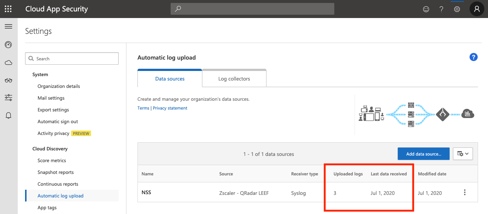


# Finish

You have now integrated Zscaler ZIA with Microsoft Cloud App Security!

Having issues with logs not appearing in MCAS? Read on...

# Troubleshooting

If MCAS isn't recieving your logs, this can usually be boiled down to a few things:

* Network Configuration
* Incorrect API Token
* Incorrect MCAS Domain or the URL was entered instead of the domain
* Not restarting the NSS service after configuring the NSS VM with the MCAS API token & domain
* The data source configured in the MCAS portal is not using the named `NSS` (see the screenshot above).
* Patience

Keep in mind that logs will not show in MCAS immediately: These are sent by NSS every hour, but you can verify that NSS is uploading them correctly. Also, MCAS can take a while to process them once they've been received.


## Verify Network Connectivity to MCAS

From the NSS VM, check you can check connectivity to MCAS by telnetting to your MCAS domain on port 443:

```
[zsroot@NSS ~]$ telnet oblivioninc.us3.portal.cloudappsecurity.com 443
Trying 40.90.218.198...
Connected to m365x855557.us3.portal.cloudappsecurity.com.
Escape character is '^]'.
```

This will confirm whether you can resolve and reach where the logs will be submitted to.


## Verify your API token and domain are correct

You can use cURL to check whether both of these are valid or not. Run the following command on your own machine (don't run this on the NSS VM) - substitute the token and URL for your own:

```
curl -v "https://oblivioninc.us3.portal.cloudappsecurity.com/api/discovery_block_scripts/?format=120&type=banned" -H "Authorization: Token QhwZGlcXGhoxxxxxx[snip]xxxxxxxGxoW"
```

If both your token and domain are valid, this command will return a list of your unsanctioned applications in MCAS:

```
*   Trying 40.90.218.198...
* Connected to oblivioninc.us3.portal.cloudappsecurity.com (40.90.218.198) port 443 (#0)
* ALPN, offering h2
* ALPN, offering http/1.1
* Cipher selection: ALL:!EXPORT:!EXPORT40:!EXPORT56:!aNULL:!LOW:!RC4:@STRENGTH
[snip]
*  SSL certificate verify ok.
> GET /api/discovery_block_scripts/?format=120&type=banned HTTP/1.1
> Host: oblivioninc.us3.portal.cloudappsecurity.com
> Authorization: Token QhwZGlxxxxxxxxxxx[snip]xxxxxxxxxxxxxxxxxxxxxx
> 
< HTTP/1.1 200 OK
< Server: nginx
< Date: Wed, 01 Jul 2020 10:59:56 GMT
< Content-Type: text/plain
< Transfer-Encoding: chunked
[snip]
< strict-transport-security: max-age=31536000
< x-content-type-options: nosniff
<
.reddit.com
.redd.it
.redditmedia.com
```


## Verify your API token and MCAS domain were entered correctly in the NSS VM

Your MCAS API token and domain are stored in the `/sc/conf/zbridge-mcas.properties` file. Verify you entered them correctly:

```
[zsroot@NSS ~]$ cat /sc/conf/zbridge-mcas.properties

# Authentication token for uploading the traffic logs
token=QhwZGlcxxxxxxxxxxxx[redacted]xxxxxxxxxxxxxx
# MCAS domain like mycompany.portal.cloudappsecurity.com
domain=oblivioninc.us3.portal.cloudappsecurity.com

# Data source name
inputStream=NSS

# Number of transactions in one batch
#batchSize=100000

# Flush interval of the batch in seconds
#flushInterval=3600
```

Ensure the `token` field accurately contains your MCAS API token.

Ensure the domain field is correct and includes the domain only! If you see `http://` or `https://` or any trailing `/`, you've entered it incorrectly.

If you need to fix anything up, run the `nss configure-mcas` command again. Don't forget to restart the NSS service afterward (`nss restart`).


## Restart the NSS Service

After any change, you should restart the NSS service:

```
[zsroot@NSS ~]$ sudo nss restart
```


## Turn on DEBUG logging

By default, `zbridge.log` will only log `INFO` and higher. You can turn on `DEBUG` logging by editing the `/sc/conf/zbridge-log4j.properties` file as follows:

```
[zsroot@NSS ~]$ vi /sc/conf/zbridge-mcas.properties

log4j.rootLogger=INFO,FILE         # Change INFO to DEBUG
log4j.logger.kafka=INFO,FILE       # Change INFO to DEBUG

log4j.appender.stdout=org.apache.log4j.ConsoleAppender
log4j.appender.stdout.layout=org.apache.log4j.PatternLayout
log4j.appender.stdout.layout.ConversionPattern=[%d] %p %m (%c)%n

log4j.appender.FILE=org.apache.log4j.RollingFileAppender
log4j.appender.FILE.File=/sc/log/zbridge.log
log4j.appender.FILE.layout=org.apache.log4j.PatternLayout
log4j.appender.FILE.layout.ConversionPattern=[%d] %p %m (%c)%n
log4j.appender.FILE.MaxFileSize=1024MB
log4j.appender.FILE.MaxBackupIndex=7


# Turn on all our debugging info - UNCOMMENT THESE!
#log4j.logger.kafka.producer.async.DefaultEventHandler=DEBUG,stdout
#log4j.logger.kafka.consumer.PartitionTopicInfo=TRACE,stdout
#log4j.logger.kafka.request.logger=TRACE,fileAppender
#log4j.additivity.kafka.request.logger=false
#log4j.logger.kafka.network.Processor=TRACE,fileAppender
#log4j.additivity.kafka.network.Processor=false
#log4j.logger.org.I0Itec.zkclient.ZkClient=DEBUG
```


Edit the file as per the comments: For the first two lines, change `INFO` to `DEBUG`, then uncomment the last 7 lines. Restart the NSS service when you are done and check the `zbridge.log` file:

```
[zsroot@NSS ~]$ tail -f /sc/log/zbridge.log

[2020-07-01 14:16:16,962] INFO Upload Response: Created (com.zscaler.bridge.proxy.ProxyConfig)
[2020-07-01 14:16:16,962] INFO Finalize Upload (com.zscaler.bridge.proxy.ProxyConfig)
[2020-07-01 14:16:16,963] DEBUG CookieSpec selected: best-match (org.apache.http.client.protocol.RequestAddCookies)
[2020-07-01 14:16:16,963] DEBUG Cookie [version: 0][name: cas_sessionid][value: xxxxxxxxxxxxxxxxxxxxxxxxxxxxx][domain: .us3.portal.cloudappsecurity.com][path: /][expiry: Wed Jul 01 15:16:13 IST 2020] match [(secure)oblivioninc.us3.portal.cloudappsecurity.com:443/api/v1/discovery/done_upload] (org.apache.http.client.protocol.RequestAddCookies)
[2020-07-01 14:16:16,963] DEBUG Auth cache not set in the context (org.apache.http.client.protocol.RequestAuthCache)
[2020-07-01 14:16:16,963] DEBUG Connection request: [route: {s}->https://oblivioninc.us3.portal.cloudappsecurity.com:443][total kept alive: 2; route allocated: 1 of 20; total allocated: 2 of 200] (org.apache.http.impl.conn.PoolingHttpClientConnectionManager)
[2020-07-01 14:16:16,963] DEBUG Connection leased: [id: 5][route: {s}->https://oblivioninc.us3.portal.cloudappsecurity.com:443][total kept alive: 1; route allocated: 1 of 20; total allocated: 2 of 200] (org.apache.http.impl.conn.PoolingHttpClientConnectionManager)
```

The log file will now be very noisy but may help.


## Check the MCAS data source is correctly named

When configuring a new data source in MCAS (Settings > Log collectors) to accept data from NSS, it must be named `NSS` EXACTLY. Naming the feed anything different will result in MCAS dropping the logs it receives from NSS.

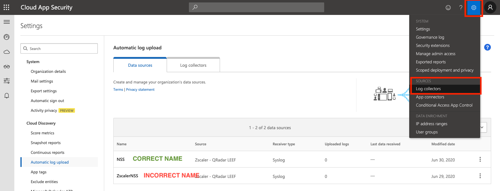

